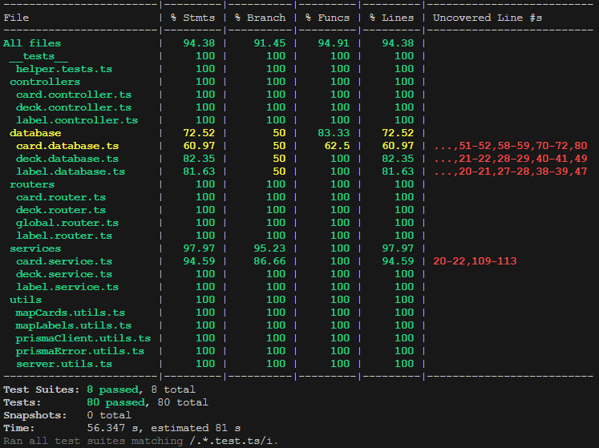

# Flashcards App

App to create decks of flashcards.

## Description

This project was made with the intention of learning and practicing React and TypeScript.

It is an app that lets the user create decks of flashcards and organize them using labels. The cards are simple and
consist only of name and content. Additionally, you may add one or more labels. You can then browse all the cards in a
deck or all cards with a particular label.

## Live Demo

You can see a demo version of the app on [myflashcardsapp.netlify.app](https://myflashcardsapp.netlify.app/).

**Important**: This version does not connect to any database, your data will be saved in the browser Local Storage. This
version also allows duplicates names do to the lack of validation and may have issues not present in the full version.

You can find the repository of this version here: [flashcards-demo](https://github.com/alvarosutter/flashcards-demo).

## Install Instructions

You can download the project and run it locally using [Docker](https://www.docker.com/).

- Go to the project folder and run the following command:
  ```bash
    sh startApp.sh
  ```
- After the containers are initialized, go to [http://localhost:3000/](http://localhost:3000/)

## Future Work

I would like to improve how the application looks. Also add two other functions, the first an option to download all the
flashcards in a PDF and the second an option to create exams where only selected flashcards are reviewed and a record
about the performance is kept.

# Backend

The backend API for Flashcards App offers routes to create, read, update and delete Decks, Cards, and Labels. The
backend was build using [NodeJs](https://nodejs.org/), [Express](https://expressjs.com/de/),
[Postgres](https://www.postgresql.org/) for the database and [Prisma](https://www.prisma.io/) as the ORM. It is written
in [TypeScript](https://www.typescriptlang.org/).

## Routes

### Deck

|   **Action**    | **Method** |         **Route**         |
| :-------------: | :--------: | :-----------------------: |
|   Create Deck   |   `POST`   |     `/api/v1/decks/`      |
| Read all Decks  |   `GET`    |     `/api/v1/decks/`      |
|    Read Deck    |   `GET`    |    `/api/v1/decks/:id`    |
| Read Deck Cards |   `GET`    | `/api/v1/decks/:id/cards` |
|   Update Deck   |  `PATCH`   |    `/api/v1/decks/:id`    |
|   Delete Deck   |  `DELETE`  |    `/api/v1/decks/:id`    |

### Card

|    **Action**    | **Method** |         **Route**          |
| :--------------: | :--------: | :------------------------: |
|   Create Card    |   `POST`   |      `/api/v1/cards/`      |
|  Read all Cards  |   `GET`    |      `/api/v1/cards/`      |
|    Read Card     |   `GET`    |    `/api/v1/cards/:id`     |
| Read Card Labels |   `GET`    | `/api/v1/cards/:id/labels` |
|   Update Card    |  `PATCH`   |    `/api/v1/cards/:id`     |
|   Delete Card    |  `DELETE`  |    `/api/v1/cards/:id`     |

### Label

|    **Action**    | **Method** |         **Route**          |
| :--------------: | :--------: | :------------------------: |
|   Create Label   |   `POST`   |     `/api/v1/labels/`      |
| Read all Labels  |   `GET`    |     `/api/v1/labels/`      |
|    Read Label    |   `GET`    |    `/api/v1/labels/:id`    |
| Read Label Cards |   `GET`    | `/api/v1/labels/:id/cards` |
|   Update Label   |  `PATCH`   |    `/api/v1/labels/:id`    |
|   Delete Label   |  `DELETE`  |    `/api/v1/labels/:id`    |

## Response

If the request was successful, the response will include a status, the data and if the data is an array, a total with
the length of the array.

```json
{
  "status": "success",
  "total": 1,
  "data": {}
}
```

If the request was a failure, the response will include a status and a message with the reason.

```json
{
  "status": "failure",
  "message": " "
}
```

## Testing

I used [Jest](https://jestjs.io/) and [Supertest](https://www.npmjs.com/package/supertest) to test the Backend code. To
run the test use the command:

```bash
    npm test
```

### Code Coverage



# Frontend

The frontend for Flashcards App offers user interface to create, read, update and delete Decks, Cards, and Labels. The
frontend was build using [NodeJs](https://nodejs.org/), [React](https://react.dev/), [Vite](https://vitejs.dev/),
[Styled Components](https://styled-components.com/) and [React Query](https://tanstack.com/query/v3/). It is written
also in [TypeScript](https://www.typescriptlang.org/).
